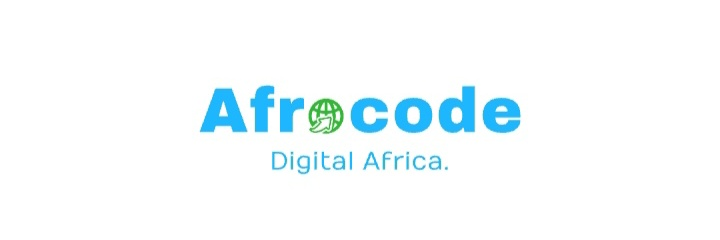

AfroCode Academy website: https://arewadatascience.github.io

# Table of Contents (AfroCode Academy DS and ML)

- [Table of Contents (AfroCode Academy)](#table-of-contents-afrocode-academy)
- [AfroCode Academy Data Science and Machine Learning Curriculum!](#afrocode-academy-data-science-and-machine-learning-curriculum)
    - [Key Features:](#key-features)
    - [Interested in Joining the Fellowship?](#interested-in-joining-the-fellowship)
    - [Contact \& Community:](#contact--community)
  - [Welcome to Cohort 3.0 AfroCode Academy Fellowship](#welcome-to-cohort-30-afrocode-academy-fellowship)
  - [Graduation Requirements](#graduation-requirements)
  - [Stage 1: Getting Started](#stage-1-getting-started)
  - [Stage 2: Data Science](#stage-2-data-science)
  - [Stage 3: Machine Learning](#stage-3-machine-learning)
  - [Career Services, Soft Skills and Mentorship](#career-services-soft-skills-and-mentorship)

#  AfroCode Academy Data Science and Machine Learning Curriculum!

The AfroCode Academy Data Science and Machine Learning Fellowship is a comprehensive, free program aimed at equipping aspiring data scientists and machine learning engineers with the skills and knowledge needed to excel in the field. 

Our curriculum is carefully designed to guide participants through the basics of programming and data analysis to the more complex concepts of machine learning algorithms and applications. With a blend of theory and practical assignments, fellows engage in a hands-on learning experience that prepares them for real-world data science challenges.

### Key Features:
- Structured curriculum covering Python, Data Science, and Machine Learning.
- Hands-on projects and challenges to apply learning in practical scenarios.
- Access to a community of mentors and peers for collaborative learning.
- Opportunities for real-world application through capstone projects.

### Interested in Joining the Fellowship?

- Applications for Cohort 3.0 have now closed, but we welcome you to participate in our sessions and access our materials for self-study. 
- Stay updated on future cohorts and get the latest information by following us on our social media pages. Additionally, join our Discord group for regular updates and insights into our fellowship program.

You can find the list of accepted fellows below.

| Component                   | Resource                                                                                                                                                                                  |
| --------------------------- | ----------------------------------------------------------------------------------------------------------------------------------------------------------------------------------------- |
| Accepted Fellows Page       | [Visit the Accepted Fellows Page](https://arewadatascience.github.io/fellows-ml-2.html)                                                                           |
| Communication channel (Discord)    | [Click here to join our Discord channel](https://discord.gg/gg6ntVcgVf)                                |

<!-- ## Stage 1: Getting Started
- The first stage in this fellowship is [Python Programming Fellowship](https://github.com/arewadataScience/python-programming-fellowship) -->

### Contact & Community:
- Website: [AfroCode Academy Official Website](https://arewadatascience.github.io)
- Email: [arewadatascience@gmail.com](mailto:arewadatascience@gmail.com)
- [Twitter](https://twitter.com/arewadatascience) | [Facebook](https://www.facebook.com/arewadatascience) | [LinkedIn](https://www.linkedin.com/company/arewadatascience) | [YouTube](https://www.youtube.com/@arewadatascienceacademy7195/videos) | [Telegram](https://t.me/+vGZvQdggp1A4NzNk)

## Welcome to Cohort 3.0 AfroCode Academy Fellowship

Welcome to the AfroCode Academy Data Science and Machine Learning Cohort 3.0 Fellowship!. We've organized the fellowship into three main parts:

- **[Stage 1: Python Programming for Data Science](#stage-1-getting-started)** - You'll learn the basics of pythons, set up your tools, and prepare for what's ahead. This stage is covered [here]()
- **[Stage 2: Data Science](#stage-2-data-science)** - This part covers data handling, from cleaning to analyzing.
- **[Stage 3: Machine Learning](#stage-3-machine-learning)** - Here, you'll dive into machine learning techniques and tools like Scikit-learn.

## Graduation Requirements

To graduate from the AfroCode Academy Data Science and Machine Learning Fellowship, fellows must meet the following criteria:

- **Completion of Curriculum**: Fellows must complete all modules within the curriculum, including the Python challenge, Data Science, Machine Learning sections, "Learning How to Learn," and "Writing in Science" courses.

- **Assignments and Medium BlogPost**: Submission of all required assignments and assigned blog post by the specified deadlines. Posts must meet the quality standards set by the mentors.

<!-- - **Attendance**: Maintain a 90% attendance rate for weekly office hours (Saturday and Sunday). See [attendance list](https://github.com/arewadataScience/ArewaDS-Machine-Learning/blob/main/Stage-1-Getting-Started/attendance.md) -->

- **Capstone Project**: Complete a capstone project that demonstrates the ability to apply learned skills to a real-world problem. The project must be approved by the AfroCode Academy Team.

<!-- ## Fellowship Kickoff

You can find the list of accepted fellows, the mentor-mentee list, the recording of the kickoff event and the slides used during the presentation below.

| Component                   | Resource                                                                                                                                                                                  |
| --------------------------- | ----------------------------------------------------------------------------------------------------------------------------------------------------------------------------------------- |
| Accepted Fellows Page       | [Visit the Accepted Fellows Page](https://arewadatascience.github.io/fellows-ml-2.html)                                                                           |
| Communication channel (Discord)    | [Click here to join our Discord channel](https://discord.gg/gg6ntVcgVf)                                | -->

## Stage 1: Getting Started
- The first stage in this fellowship is [Python Programming Fellowship](https://github.com/arewadataScience/python-programming-fellowship)

- This stage must be completed before progressing to the next one.

## Stage 2: Data Science

**Duration: 6 weeks**  

- The second part of the fellowship is all about Data Science. 
  
- You'll learn to clean, visualize, and analyze data, which are key steps in any data science project. 

- Recommended Reading: [Python for Data Analysis](https://wesmckinney.com/book/) and [Python Data Science](https://jakevdp.github.io/PythonDataScienceHandbook/).

| Learning Objectives and Topics                                                                                          | Lesson Resources                        | Mentor |
| ----------------------------------------------------------------------------------------------------------------------- | --------------------------------------- | ------ |
| Learn the basic concepts behind data science and its relationship with AI, machine learning, and big data.              | [Introduction to Data Science](1-Introduction/README.md)       | A.I DIKKO |
| Numpy | [Numpy Notebook](https://lukmanaj.quarto.pub/introduction-to-numpy/) \| [numpy-100-exercise](https://github.com/arewadataScience/ArewaDS-Machine-Learning/blob/main/100_numpy_exercise.md)       | A.I DIKKO |
| Pandas.                                                            | [Pandas Notebook](#) \| [Pandas exerices](https://github.com/guipsamora/pandas_exercises)      | A.I DIKKO |
| Working With Data: Techniques for cleaning and transforming data to address challenges like missing or inaccurate data. | [Data Preparation Techniques](2-Working-With-Data/04-data-preparation/README.md)        | A.I DIKKO |
| Introduction to Matplotlib. | [Working with Matplotlib](https://github.com/arewadataScience/ArewaDS-Machine-Learning/blob/main/00_Slides-Notebooks-Materials/05_Introduction_to_Matplotlib.ipynb)        | A.I DIKKO |
| Visualizing Quantities : Learn to use Matplotlib to visualize data, such as bird populations.                                                    | [Quantities Visualizing ](3-Data-Visualization/05-visualization-quantities/README.md)        | A.I DIKKO |
| Visualizing Distributions of Data: Visualize observations and trends within intervals.                                                                     | [Data Distributions Visualization](3-Data-Visualization/06-visualization-distributions/README.md)   | A.I DIKKO |
| Visualizing Proportions: Visualize discrete and grouped percentages.                                                                             | [Proportions Visualization](3-Data-Visualization/07-visualization-proportions/README.md)          | A.I DIKKO |
| Visualizing Relationships : Visualize connections and correlations between datasets and variables.                                                  | [Relationships Visualization](3-Data-Visualization/08-visualization-relationships/README.md)        | A.I DIKKO |
| Meaningful Visualizations : Create valuable visualizations for effective problem-solving and insights.                                              | [Creating Meaningful Visualizations](3-Data-Visualization/09-meaningful-visualizations/README.md) | A.I DIKKO |

## Stage 3: Machine Learning 

**Duration: 8 weeks**

In the final part of the fellowship, we'll focus on Machine Learning. You'll learn about different algorithms and how to implement them using popular libraries like Scikit-learn.

Recommended Book: 

- [Machine Learning with PyTorch and Scikit-Learn Book](#) and [Youtube Series on this book chapters](https://www.youtube.com/playlist?list=PLr3-oFRsHRaZwmVUPMvnDUZV-j2zaK5zU).

- Hands-On Machine Learning with Scikit-Learn, Keras, and TensorFlow 3e: Concepts, Tools, and Techniques to Build Intelligent Systems

In the final part of the fellowship, we'll focus on Machine Learning. You'll learn about different algorithms and how to implement them using popular libraries like Scikit-learn.

| Topic/Learning Objectives                                                                                              | Lesson Group                   | Lesson Resources                                                                 | Mentor |
|------------------------------------------------------------------------------------------------------------------------|----------------------------------|-----------------------------------------------------------------------------------|--------|
| Introduction to Machine Learning: Learn the basic concepts behind machine learning.                                     | Introduction                     | [Lesson](https://github.com/arewadataScience/ArewaDS-Machine-Learning/tree/main/5-Introduction-to-ML/1-intro-to-ML)                | A.I DIKKO   |
| The History of Machine Learning: Learn the history underlying this field.                                              | Introduction                     | [Lesson](https://github.com/arewadataScience/ArewaDS-Machine-Learning/tree/main/5-Introduction-to-ML/2-history-of-ML)              | A.I DIKKO    |
| Techniques for Machine Learning: Discover the techniques ML researchers use to build ML models.                        | Introduction                     | [Lesson](https://github.com/arewadataScience/ArewaDS-Machine-Learning/tree/main/5-Introduction-to-ML/4-techniques-of-ML)           | A.I DIKKO    |
| Introduction to Regression: Get started with regression models using Python and Scikit-learn.                     | Regression                      | [Lesson](https://github.com/arewadataScience/ArewaDS-Machine-Learning/tree/main/6-Regression)                                 | A.I DIKKO   |
| North American Pumpkin Prices 🎃: Visualize and clean data; build linear, polynomial, and logistic regression models.  | Regression                      | [Lesson](https://github.com/arewadataScience/ArewaDS-Machine-Learning/tree/main/6-Regression)                                 | A.I DIKKO    |
| Introduction to Classification: Introduction to data cleaning, preparation, and visualization for classification.    | Classification                  | [Lesson](https://github.com/arewadataScience/ArewaDS-Machine-Learning/blob/main/7-Classification/1-Introduction/README.md)  \|[Session Notebook](https://github.com/arewadataScience/ArewaDS-Machine-Learning/blob/main/Notebooks/classification.ipynb)                         | A.I DIKKO   |
| Delicious Asian and Indian Cuisines 🍜: Learn about classifiers; build a recommender web app using your model.               | Classification                  | [Lesson](https://github.com/arewadataScience/ArewaDS-Machine-Learning/tree/main/7-Classification)    \|[Session Notebook](https://github.com/arewadataScience/ArewaDS-Machine-Learning/blob/main/Notebooks/classification.ipynb)                           | A.I DIKKO    |
| Introduction to Clustering: Learn about clustering and data visualization.                                       | Clustering                      | [Lesson](Machine-Learning/5-Clustering/1-Visualize/README.md)                     | A.I DIKKO    |
| Exploring Nigerian Musical Tastes 🎧: Explore the K-Means clustering method with music data.                               | Clustering                      | [Lesson](Machine-Learning/5-Clustering/2-K-Means/README.md)                       | A.I DIKKO    |
| Introduction to Natural Language Processing ☕️: Learn the basics of NLP by building a simple bot.                                    | Natural Language Processing     | [Lesson](Machine-Learning/6-NLP/1-Introduction-to-NLP/README.md) \| [Notebook](https://colab.research.google.com/drive/1YIS6Jq8fQkmN2WIm4cnSv5Q5NF3_DZwA)                 | A.I DIKKO    |
| Common NLP Tasks ☕️: Understand common tasks in NLP dealing with language structures.                     | Natural Language Processing     | [Lesson](Machine-Learning/6-NLP/README.md) \| [Notebook](https://colab.research.google.com/drive/1YIS6Jq8fQkmN2WIm4cnSv5Q5NF3_DZwA)                                       | A.I DIKKO    |
| Translation and Sentiment Analysis ♥️: Perform translation and sentiment analysis with literary texts.                      | Natural Language Processing     | [Lesson](Machine-Learning/6-NLP/3-Translation-Sentiment/README.md)                | A.I DIKKO    |
| Romantic Hotels of Europe ♥️: Conduct sentiment analysis with European hotel reviews.                              | Natural Language Processing     | [Lesson](Machine-Learning/6-NLP/4-Hotel-Reviews-1/README.md)                      | A.I DIKKO    |
| Introduction to Time Series Forecasting: Learn the basics of time series forecasting.                                         | Time Series                     | [Lesson](Machine-Learning/7-TimeSeries/README.md)                                 | A.I DIKKO    |
| Introduction to Reinforcement Learning: Get introduced to reinforcement learning with Q-Learning.                            | Reinforcement Learning          | [Lesson](Machine-Learning/8-Reinforcement/README.md)                              | A.I DIKKO    |
| A guide to Upwork freelancing                                                 | Upwork                           | [Lesson](#)    | A.I DIKKO    |
| Completing DataCamp Data Scienec Certification                                | Data Science Certification       | [Lesson](#)    | A.I DIKKO    |
| Introduction to Kaggle: Learn how to participate in Kaggle competition                                       | Kaggle                          | [Lesson](https://machinelearningmastery.com/get-started-with-kaggle/)                                                                       | A.I DIKKO    |
| MLFlow**: Learn how to get started with MLflow                                                 | MLFlow                           | [Lesson](#)                                                                       | A.I DIKKO    |

## Career Services, Soft Skills and Mentorship

After completion of our program, we offer career services to support you as you make the pivotal transition from fellowship to career, ensuring you're well-equipped to navigate the competitive job market and emerge as a standout candidate in the world of data science and machine learning.

- **Career Advising**: One-on-one mentorship sessions to plan your career trajectory.
- **Resume/CV and LinkedIn Reviews**: Tailored advice to polish your CV and professional profiles.
- **Development of Portfolio Website**: Learn to create a personal website to feature your bio, CV, projects, and professional accomplishments.
- **Capstone Project Showcase**: Strategies to highlight your project for employers and peers.
- **Presentation Skills**: Training to present your ideas and findings clearly.
- **Alumni Network**: Access to our alumni community for networking and support.
- **Scholarship Guidance**: Assistance with applications for educational and research funding.
- **Academic Paper Writing Support**: Resources and mentorship for collaborating, writing and publishing papers.
- **Join HausaNLP Research Group**: Engage with NLP research and contribute to Hausa language technology projects.

AfroCode Academy Fellowship
